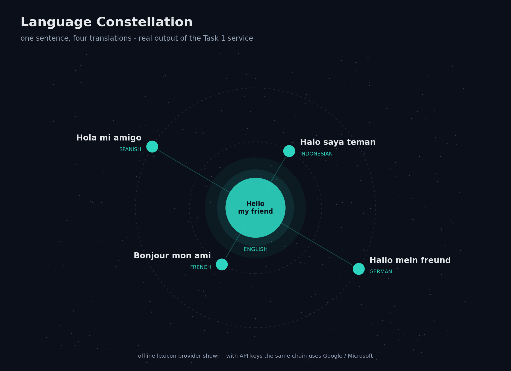

# Task 1: Language Translation Tool

**Purpose.** Let a user type text, pick source and target languages, and read the translation, using a real translation API.

| | |
|---|---|
| **Input** | Text (max 5,000 characters), source language (or `auto`), target language |
| **Output** | Translated text, the provider that produced it, whether it came from cache; optional MP3 speech |



## How it works

```
text ─► validate ─► cache? ─► Google Cloud ─► Microsoft ─► Google (keyless) ─► MyMemory ─► offline lexicon
                     hit ◄──────────  first provider that is configured AND succeeds wins
```

Keyed providers are skipped when no key is set, so out of the box the chain starts at the
keyless Google endpoint. Every request has a timeout, so a bad connection never freezes the app.

- `translator/base.py` – the `TranslationProvider` interface (`is_available`, `translate`).
- `translator/providers/` – `google_cloud.py` (Cloud Translation v2), `microsoft.py` (Translator v3.0), `keyless.py` (Google public endpoint + MyMemory, no account), `offline.py` (bundled lexicon).
- `translator/service.py` – `TranslationService`: validation, LRU cache, provider fallback. Depends only on the interface.
- `translator/languages.py` – the 15 supported languages, in one place.
- `translator/tts.py` – optional gTTS text-to-speech.
- `translator/ui.py` – the Streamlit page (copy icon, listen button, warning when only the offline fallback answered); used by `app.py` and the root dashboard.
- `cli.py` – terminal front-end.

## Run

```bash
pip install -r Task1/requirements.txt
streamlit run Task1/app.py                         # or the "1 · Translator" page of the root app
python Task1/cli.py "good morning" -t id            # add --offline to skip the network
```

### Using a real API
Copy `.env.example` to `.env` (or export the variables) and set one or both:

```
GOOGLE_TRANSLATE_API_KEY=...
MICROSOFT_TRANSLATOR_KEY=...      MICROSOFT_TRANSLATOR_REGION=global
```

The provider chain is shown at the top of the web app, and every result says which provider produced it.

## Tests
`pytest Task1` (17 tests) – fallback order, skipped providers, caching, validation, offline pivot translation, timeouts, and the exact request/response handling of all four online providers against a fake HTTP session.

## Limitations
- Tests use mocked HTTP, so try one real translation to confirm your connection or key.
- The keyless endpoints are free and meant for personal use; heavy use can be rate-limited. Use a Google or Microsoft key for anything serious.
- The offline lexicon (~75 words, English / Indonesian / Spanish / French / German) translates word by word. For other languages it refuses with a clear message instead of returning the input unchanged.
