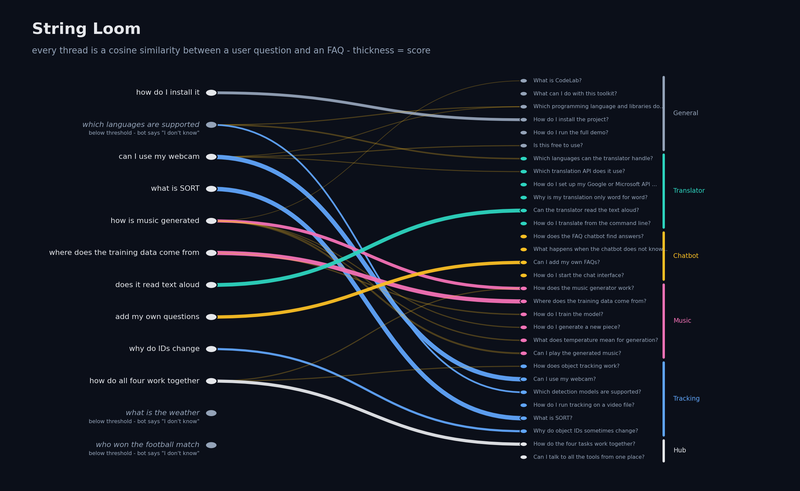

# Task 2: Chatbot for FAQs

**Purpose.** Answer a user's question with the answer of the most similar FAQ.

| | |
|---|---|
| **Input** | A free-text question; the FAQ table `data/faqs.csv` (`category, question, answer`) |
| **Output** | The best answer, a "did you mean…" list when unsure, or an honest "I don't know" |

The FAQ topic is the CodeLab toolkit itself (30 entries), so the bot can explain the other three tasks.



## How it works

1. **Preprocess** (`faq_bot/preprocess.py`) – lowercase → NLTK `RegexpTokenizer` → remove stop words → `PorterStemmer`. No NLTK corpus download is needed.
2. **Vectorise** (`faq_bot/matcher.py`) – TF-IDF with unigrams and bigrams, fitted on all questions and answers.
3. **Match** – cosine similarity of the query against questions (weight 0.75) and answers (0.25). Users echo question wording, so questions count more; answers help with indirect phrasing.
4. **Decide** (`faq_bot/bot.py`) – score ≥ 0.35 answer directly; 0.15–0.35 suggest the closest questions; below 0.15 say "I don't know". Greetings, thanks and goodbyes are handled first.

## Run

```bash
pip install -r Task2/requirements.txt
streamlit run Task2/app.py       # chat UI (also the "2 · FAQ Chatbot" page of the root app)
python Task2/cli.py              # terminal chat
```

Add your own FAQs by appending rows to `data/faqs.csv`.

## Tests
`pytest Task2` (9 tests) – preprocessing, five paraphrase queries that must hit the right FAQ, empty queries, small talk, fallback and confident answers.

## Development note
Two paraphrases failed at first because answer text outweighed question text (the tracking answer repeats "SORT", so it beat the FAQ titled "What is SORT?"). The fix was the separate question/answer weighting above, plus dropping request verbs like "explain" as stop words, not loosening the tests.

## Limitations
TF-IDF matches words, not meaning. A synonym it has never seen ("supported" vs "handle") can miss, as the loom picture shows. Sentence embeddings would fix this at the cost of a large model download.
