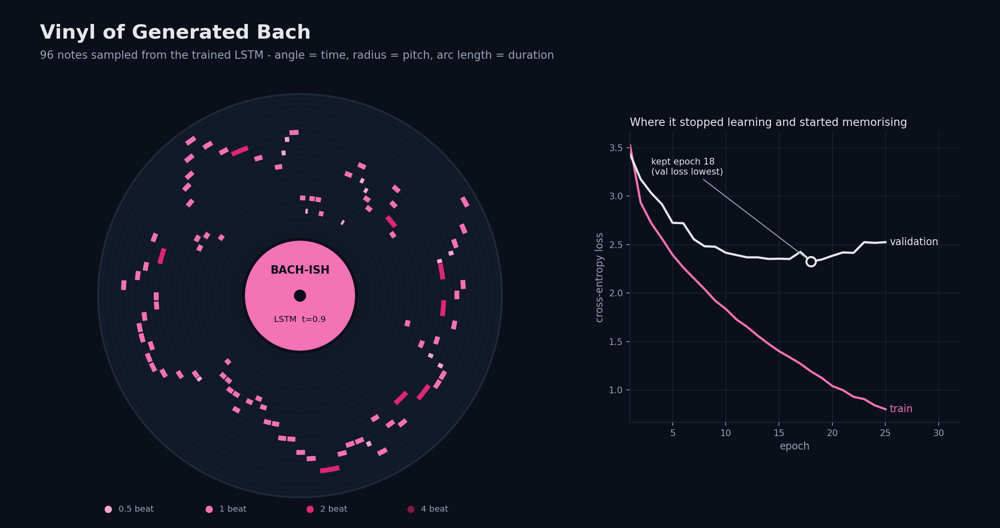

# Task 3: Music Generation with AI

**Purpose.** Train a recurrent network on classical music and let it write new melodies.

| | |
|---|---|
| **Input** | Bach chorales bundled with `music21` (150 used), or your own folder of `.mid` files |
| **Output** | `models/bach_lstm.pt` checkpoint, plus generated `.mid` and playable `.wav` files (see `outputs/sample.*`) |



## How it works

1. **Preprocess** (`music_gen/data.py`)
   - Transpose each chorale to C major / A minor, so the same harmony always yields the same token.
   - Take the **soprano** line (chosen by part name, not position: some scores list instruments first).
   - Encode every note as one token, `"64@1.0"` = MIDI pitch 64 for 1.0 beats (durations snapped to 0.5 / 1 / 2 / 4).
   - Result: 8,205 tokens, vocabulary of 78.
2. **Model** (`music_gen/model.py`) – embedding (64) → 2-layer LSTM (128) → linear layer over the vocabulary; predicts the next token from the previous 24.
3. **Train** (`music_gen/train.py`) – Adam, gradient clipping, validation on held-out *pieces* (no window leakage). The best-validation weights are kept: on the shipped run validation loss was lowest at **epoch 18 (2.32, 42.7 % next-note accuracy)** and rose afterwards while training loss kept falling, so later epochs are discarded. About 35 s on a CPU.
4. **Generate** (`music_gen/generate.py`) – sample note by note. *Temperature* sets adventurousness; *top-k* removes unlikely notes; a seed phrase and RNG seed are supported.
5. **Export** (`music_gen/export.py`) – MIDI via music21; WAV via a small NumPy additive synthesiser (no FluidSynth or sound-font needed).

### Why one voice and not full chords?
The first attempt tokenised whole chords. Even after transposition, passing tones produced thousands of one-off chords and only ~67 % of tokens were in the vocabulary, so the model would mostly have learned `<unk>`. The melody line covers 99.8 %.

## Run

```bash
pip install -r Task3/requirements.txt
python Task3/cli.py train                                  # or --epochs 30 / --midi-dir my_midis/
python Task3/cli.py generate --length 64 --temperature 0.9 --seed 3
streamlit run Task3/app.py                                 # sliders, play in browser, download
```

The trained checkpoint and a cached token corpus ship in `models/`, so `generate` works immediately. `--refresh` re-parses the corpus.

## Tests
`pytest Task3` (6 tests) – token round-trips, vocabulary, windows, a tiny model that must reduce its loss, reproducible sampling, valid MIDI header and WAV.

## Limitations
Small data and a small model: the output is Bach-flavoured melody, not convincing Bach, and it is monophonic.
