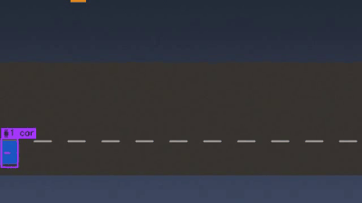
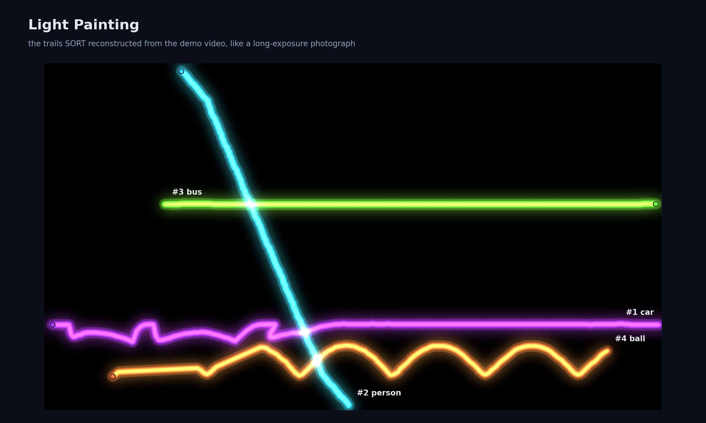

# Task 4: Object Detection and Tracking

**Purpose.** Read video (webcam or file), find objects in every frame with a pre-trained model, and give each object an ID that stays the same over time.

| | |
|---|---|
| **Input** | Webcam index (`0`) or a video file |
| **Output** | Live window or annotated video with boxes, `#id label` tags and trails; a `SceneReport` (tracked objects, trails, mean speed) |




## How it works

```
frame ─► Detector ─► [Detection] ─► SORT ─► [TrackedObject #id] ─► draw / window / video / report
```

- **Detectors** (`tracking/detectors.py`) share one method, `detect(frame)`, and are created by `build_detector()`:
  - `YoloDetector` (default) – pre-trained **YOLOv8n** through `ultralytics`, 80 COCO classes (person, car, bus, dog, bottle, …). The weights (~6 MB) download to `Task4/models/` on first use.
  - `MotionDetector` – OpenCV MOG2 background subtraction; needs no model. Used when ultralytics is missing, and for the synthetic demo scene (coloured shapes YOLO was never trained on), where a `ColorLabeler` names the shapes.
- **SORT** (`tracking/sort.py`, `kalman.py`) – per frame: predict each track with a constant-velocity **Kalman filter** (pure NumPy) → match detections to predictions with the **Hungarian algorithm** on IoU → update matches, start tracks for new detections, drop tracks unseen for `max_age` (30) frames. Labels use a majority vote so they don't flicker.
- **Pipeline** (`tracking/pipeline.py`) – OpenCV capture loop (DirectShow for webcams on Windows), live window with an fps counter (`q`, `Esc` or the window's X to quit), optional video writer.
- **Web page** (`tracking/ui.py`) – upload a video or use the demo, watch the annotated result in the browser (WebM), download it, or detect objects in a webcam snapshot.

## Run

```bash
pip install -r Task4/requirements.txt
python Task4/cli.py --source 0 --show                          # live webcam (run_webcam.bat on Windows)
python Task4/cli.py --source my_video.mp4 --output tracked.mp4 # a video file
python Task4/cli.py --demo --show                              # synthetic demo scene
python Task4/cli.py --source 0 --show --detector motion        # without YOLO
streamlit run Task4/app.py                                     # web page
```

Useful options: `--confidence 0.5` (fewer, surer detections), `--max-age 60` (keep IDs through longer occlusions), `--weights Task4/models/yolo11n.pt` (another YOLO model; known names download automatically).

## Results

- **Real video, YOLO:** a camera pan across a street photo with four people and a bus → 4 `person` tracks + 1 `bus` track, one ID each (`test_yolo_detects_real_objects` checks the detector on the same photo).
- **Demo scene, motion detector:** exactly four tracks (car, bus, person, ball).

## Development notes
- **One object, two boxes.** On the real video YOLO first reported the bus twice, once as `bus` and once as `truck`, because its non-maximum suppression works per class. With `agnostic_nms=True` one object gives one box, so one track.
- **Motion detector fragmentation.** The first version reported 8 tracks for the 4 demo objects. MOG2 absorbs a pixel into the background after ~10 frames, so slow objects lost their trailing half. A lower background ratio and a fixed low learning rate fixed it.
- `max_age=30` (instead of SORT's usual 1) lets tracks coast through brief misses on the Kalman prediction.
- Browsers cannot play OpenCV's default MP4 codec (`mp4v`), so the web page writes VP8 WebM, which was checked to play in Chromium.

## Tests
`pytest Task4` (10 tests) – IoU values, Kalman velocity learning, ID stability when paths cross, gap survival and expiry, label voting, detector factory, clear errors for a missing webcam or file, an end-to-end run on the demo video, and the real YOLO model (skipped until the weights have been downloaded once).

## Limitations
SORT has no appearance model, so identities can swap after long occlusions; Deep SORT would be the next step. The motion fallback assumes a static camera. YOLOv8n favours speed over accuracy on a CPU; pass a larger model with `--weights` if you have a GPU.
